  <a href="https://benardkimani.co.ke/">Portfolio</a> ·
  <a href="https://medium.com/@swiftkimani">Medium</a> ·
  <a href="https://twitter.com/swiftkimani">X / Twitter</a> ·
  <a href="https://github.com/swiftkimani?tab=repositories">All repositories</a>

I'm Benard "Swift" Kimani, a software engineer in Nairobi. I build voice interfaces, agent tooling and software that keeps working when the network doesn't, mostly in Rust and TypeScript, with Go where throughput matters.

<h3></h3>

<table>
  <tr>
    <td width="50%" valign="top">
      <h4><a href="https://github.com/swiftkimani/kaziscout">kaziscout</a></h4>
      <code>TypeScript</code> <code>agent</code> <code>local-first</code>
      
Job-search agent that runs on your own computer. Reads 131 job boards and employer career pages, deepest in Africa, scores roles against your CV and tracks applications.

    </td>
    <td width="50%" valign="top">
      <h4><a href="https://github.com/swiftkimani/voice-mcp">voice-mcp</a></h4>
      <code>Rust</code> <code>MCP</code> <code>whisper.cpp</code>
      
Voice in and out for any MCP client: offline speech-to-text, OS text-to-speech and keystrokes, in one small binary.

    </td>
  </tr>
  <tr>
    <td width="50%" valign="top">
      <h4><a href="https://github.com/swiftkimani/figma-canvas-mcp">figma-canvas-mcp</a></h4>
      <code>Rust</code> <code>MCP</code> <code>design-to-code</code>
      
Reads a live Figma canvas over a local plugin bridge and reconstructs it as code. No API token, no rate limit.

    </td>
    <td width="50%" valign="top">
      <h4><a href="https://github.com/swiftkimani/hyper-voice">hyper-voice</a></h4>
      <code>Lua</code> <code>Hammerspoon</code> <code>macOS</code>
      
Push-to-talk voice control for the Hyper terminal. Offline whisper.cpp for dictation, any LLM for free-form commands.

    </td>
  </tr>
  <tr>
    <td width="50%" valign="top">
      <h4><a href="https://github.com/swiftkimani/sauti-salama">sauti-salama</a></h4>
      <code>TypeScript</code> <code>USSD</code> <code>offline-first</code>
      
GBV reporting and referral line for Kenya over USSD, SMS and voice, with triage, referral pathways and encrypted case handling. <a href="https://sauti.benardkimani.co.ke">Live proof of concept</a>.

    </td>
    <td width="50%" valign="top">
      <h4><a href="https://github.com/swiftkimani/nova">nova</a></h4>
      <code>TypeScript</code> <code>Next.js</code> <code>design tokens</code>
      
Product boilerplate with a token-driven design system, light and dark modes, API routes and optional Docker.

    </td>
  </tr>
</table>

<h3></h3>

<table>
  <tr>
    <td width="50%" valign="top">
      <h4><a href="https://github.com/swiftkimani/asset-nexus">asset-nexus</a></h4>
      <code>TypeScript</code> <code>Next.js 15</code> <code>Turso</code>
      
Asset lifecycle management: track, assign and report on hardware and software, with role-based access control and bulk import and export. <a href="https://asset.benardkimani.co.ke/">Live</a>.

    </td>
    <td width="50%" valign="top">
      <h4><a href="https://github.com/swiftkimani/social-scheduler">social-scheduler</a></h4>
      <code>Go</code> <code>Next.js</code> <code>agent</code>
      
Scheduling agent for X and LinkedIn posts that runs as an OpenCode subagent or a standalone CLI, on a Go backend.

    </td>
  </tr>
  <tr>
    <td width="50%" valign="top">
      <h4><a href="https://github.com/swiftkimani/FabricSim">FabricSim</a></h4>
      <code>C++</code> <code>networking</code> <code>simulation</code>
      
Simulator for adaptive, congestion-aware routing across GPU interconnect topologies. Built module by module, from sockets up.

    </td>
    <td width="50%" valign="top">
      <h4><a href="https://github.com/swiftkimani/goolang-backend">goolang-backend</a></h4>
      <code>Go</code> <code>CQRS</code> <code>OpenTelemetry</code>
      
My maintained fork of gemyago's Go backend boilerplate: OpenAPI-first handlers, tracing, SQLite and an MCP server. <a href="https://dev.benardkimani.co.ke/docs.html">Live docs</a>.

    </td>
  </tr>
  <tr>
    <td width="50%" valign="top">
      <h4><a href="https://github.com/swiftkimani/invoice-generator">invoice-generator</a></h4>
      <code>TypeScript</code> <code>small business</code>
      
Invoice generation for small businesses, built to take the busywork out of billing. <a href="https://invoice.benardkimani.co.ke/">Live</a>.

    </td>
    <td width="50%" valign="top">
      <h4><a href="https://github.com/swiftkimani/cipher-protocol">cipher-protocol</a></h4>
      <code>HTML</code> <code>CSS</code> <code>vanilla JS</code>
      
Landing page for a hacker game set in Nairobi, 2049. No framework, mobile-first, light and dark modes.

    </td>
  </tr>
</table>

<h3></h3>

<!-- BLOG-POST-LIST:START -->
- [Social Scheduler: An AI-Powered Publishing Pipeline](https://medium.com/@Swiftkimani/social-scheduler-an-ai-powered-publishing-pipeline-f94df0e05a5d?source=rss-95c6ec5118f1------2)
- [Asset Nexus: Building an Enterprise Asset Lifecycle System](https://medium.com/@Swiftkimani/asset-nexus-building-an-enterprise-asset-lifecycle-system-8c00219d2d16?source=rss-95c6ec5118f1------2)
- [Build a Task Tracker App with Vite and React](https://medium.com/@Swiftkimani/build-a-task-tracker-app-with-vite-and-react-8176879aa42e?source=rss-95c6ec5118f1------2)
<!-- BLOG-POST-LIST:END -->

<h3></h3>

  

The motion on this page is plain SVG and CSS, no scripts. The panels are generated by <a href="scripts/build_assets.py"><code>scripts/build_assets.py</code></a> and stay still if your system asks for reduced motion.
